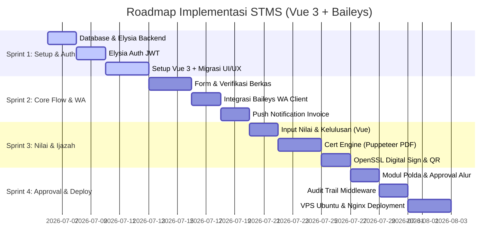

# Rencana Implementasi & Sprint Roadmap (DIPERBARUI)
## Security Training Management System (STMS)

Dokumen ini berisi rencana kerja yang telah disesuaikan dengan keputusan teknologi terbaru untuk mengimplementasikan aplikasi **Security Training Management System (STMS)**.

---

## 1. Penyelarasan Teknologi Terpilih (MVP Stack)

*   **Backend Runtime:** **Bun v1.x** (sangat cepat untuk I/O dan eksekusi TypeScript native).
*   **Backend API Framework:** **Elysia.js** (tipe data aman end-to-end via TypeBox).
*   **Database:** **PostgreSQL 16+** dengan **Prisma ORM**.
*   **Frontend:** **Vue 3 (Composition API)** + **Vite** + **Pinia (State Management)** + **Vue Router** + **Tailwind CSS**.
    *   *Catatan Migrasi:* Kita akan memigrasikan struktur visual dan mock data dari prototipe React `docs/UI:UX/src/app/App.tsx` ke dalam komponen Vue 3 Single File Components (SFC).
*   **Ijazah Engine (PDF):** **Puppeteer (Chromium Headless)** di dalam Bun untuk render HTML ke PDF.
*   **Keamanan PDF (TTD Digital):** Menggunakan **Self-Signed Certificate** yang dibuat menggunakan **OpenSSL** untuk kebutuhan MVP, ditandatangani menggunakan library `pdf-lib` / `node-signpdf`.
*   **WhatsApp Gateway:** Integrasi lokal menggunakan library **Baileys** (menjalankan client WhatsApp Web secara mandiri di server backend menggunakan autentikasi scan QR Code).

---

## 2. Struktur Proyek Akhir

```
stms/
├── docs/                      # Spesifikasi & Prototipe UI/UX asli
├── stms-backend/              # Proyek Backend (Bun + Elysia.js)
│   ├── prisma/                # Skema database & migrasi
│   ├── src/
│   │   ├── domains/           # Domain-Driven Design (DDD)
│   │   │   ├── Auth/          # Login & Session JWT
│   │   │   ├── Registration/  # Upload dokumen pendaftaran
│   │   │   ├── Training/      # Data angkatan diklat & absensi
│   │   │   ├── Grading/       # Input komponen nilai
│   │   │   ├── Cert_Engine/   # Pembuatan PDF ijazah & TTD OpenSSL
│   │   │   └── Verification/  # Verifikasi publik QR Code
│   │   ├── shared/            # Database Client & Baileys WA Client Helper
│   │   └── index.ts           # Entry point Elysia
│   ├── storage/               # Folder lokal penyimpanan PDF & sesi WhatsApp
│   └── package.json
└── stms-frontend/             # Proyek Frontend (Vue 3 + Vite + Tailwind)
    ├── src/
    │   ├── components/        # Komponen reusable (Navbar, Sidebar, Button)
    │   ├── stores/            # Pinia Stores (auth.js, registration.js, grade.js)
    │   ├── router/            # Vue Router (guards untuk multi-role)
    │   ├── views/             # Halaman modular (Dashboard, InputNilai, Verifikasi)
    │   ├── App.vue            # Root component Vue
    │   └── main.js            # Entry point Vue
```

---

## 3. Pembagian Fase & Sprint (4 Minggu)

Rencana kerja dibagi menjadi **4 Sprint** dengan durasi masing-masing 1 minggu:



---

### **Sprint 1: Setup Proyek, Basis Data, & Autentikasi**
*   **Backend:**
    *   Inisialisasi database PostgreSQL menggunakan **Prisma ORM**. Buat tabel `users`, `training_batches`, `registrants`, `grades`, `certificates`, dan `audit_trails`.
    *   Setup server **Elysia.js** dengan CORS dan JWT.
    *   Implementasikan endpoint login `POST /api/v1/auth/login` (verifikasi hash password user).
*   **Frontend:**
    *   Inisialisasi proyek **Vue 3** menggunakan Vite dan pasang Tailwind CSS, Pinia, dan Vue Router.
    *   Migrasikan tata letak dashboard dan menu-menu dari prototipe React ke dalam Vue 3 Single File Components.
    *   Implementasikan Pinia Store `auth.js` dan route guard untuk menyaring akses halaman berdasarkan role (`ADMIN_PUSDIKLAT`, `POLDA_VERIFICATOR`, `PESERTA`).

---

### **Sprint 2: Registrasi Peserta, Validasi Berkas, & WhatsApp Baileys**
*   **Backend:**
    *   Buat endpoint `POST /api/v1/registration/apply` dengan dukungan upload berkas pendaftaran (KTP, SKCK, dll.) menggunakan Bun API.
    *   Implementasikan class `WhatsAppService` menggunakan **Baileys** yang berjalan secara mandiri di backend server. Layanan ini akan mengekspor QR Code ke konsol/log admin pada kali pertama dijalankan untuk ditautkan dengan handphone server.
*   **Frontend:**
    *   Buat wizard pendaftaran bagi Peserta untuk mengunggah dokumen-dokumen persyaratan di aplikasi Vue.
    *   Buat halaman verifikasi dokumen bagi Admin Pusdiklat untuk menyetujui atau menolak pendaftaran.
*   **Notifikasi:**
    *   Picu pengiriman notifikasi WhatsApp otomatis melalui Baileys: status berkas ditolak (revisi) atau berkas disetujui (kirim link Invoice tagihan).

---

### **Sprint 3: Modul Penilaian, Ijazah Engine, & Verifikasi Publik**
*   **Penilaian & Kelulusan:**
    *   Buat UI tabel penilaian massal pada Vue 3. Admin dapat menginput komponen nilai siswa (Teori, Fisik, Menembak, Damkar) secara instan.
    *   Buat endpoint `PUT /api/v1/grades/:registrant_id` untuk menyimpan nilai dan menetapkan status `LULUS`/`TIDAK_LULUS`.
*   **Ijazah Engine:**
    *   Implementasikan mesin pembuat PDF lanskap A4 dengan Puppeteer (Chromium Headless) di backend Bun.
    *   Gunakan perintah **OpenSSL** untuk membuat sertifikat digital otoritas (*self-signed certificate*).
    *   Gunakan library `pdf-lib` / `node-signpdf` untuk menandatangani file PDF ijazah secara digital menggunakan sertifikat tersebut.
    *   Simpan file PDF ijazah di direktori privat terisolasi `/storage/secure_certs/`.
*   **QR Code & Verifikasi:**
    *   Buat token SHA-256 unik untuk setiap ijazah yang diterbitkan.
    *   Buat halaman publik `/verify/:token` (Vue) yang menampilkan keaslian data ijazah satpam ketika QR Code pada ijazah fisik di-scan.

---

### **Sprint 4: Modul Approval Polda, Audit Trail, & Deployment**
*   **Polda Approval:**
    *   Buat modul khusus bagi Verifikator Polda untuk meninjau nilai angkatan dan memberikan persetujuan penerbitan ijazah kedinasan (menginput nomor ijazah kedinasan resmi).
    *   Setelah disetujui, sistem memicu pembuatan PDF ijazah bertanda tangan digital dan mengirim notifikasi WhatsApp berisi link download langsung ke HP Peserta.
*   **Audit Trail:**
    *   Pasang middleware audit trail pada backend Elysia untuk memantau aktivitas perubahan nilai dan penerbitan ijazah, mencatat perubahan data sebelum (*before*) dan sesudah (*after*) ke tabel `audit_trails`.
*   **Deployment:**
    *   Tulis integration tests backend menggunakan `bun:test`.
    *   Deploy frontend statis hasil build Vue 3 ke Nginx.
    *   Deploy backend Bun API dan service Baileys (menjaga agar runtime tetap menyala menggunakan PM2 / Systemd).
    *   Setup SSL Let's Encrypt pada domain server VPS Ubuntu.

---

## 4. Kriteria Keberhasilan (Success Criteria)

1.  **Rendering PDF:** Pembuatan satu file PDF ijazah via Puppeteer membutuhkan waktu kurang dari 3 detik.
2.  **Keamanan Akses Ijazah:** File PDF tidak dapat diakses langsung secara publik, melainkan melalui *authorized stream route* dengan pemeriksaan token JWT (HTTP status `403 Forbidden` jika mengunduh milik orang lain).
3.  **Integritas Dokumen:** File PDF yang telah ditandatangani dengan sertifikat digital self-signed OpenSSL akan memicu tanda peringatan perubahan (*document modified warning*) pada Adobe Acrobat Reader jika isi PDF diubah secara ilegal.
4.  **WhatsApp Push Notif:** Pengiriman pesan Baileys terkirim ke ponsel target dengan tingkat keberhasilan > 98% (selama server Baileys terhubung ke internet dan nomor WhatsApp pengirim aktif).
